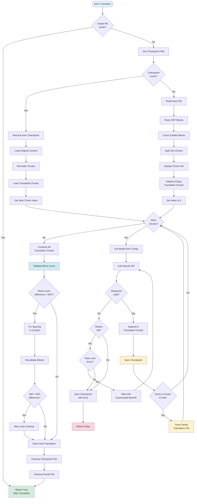

# Translation Service Documentation

## 1. Description

The `TranslationService` is a robust subtitle translation service that uses OpenAI's API to translate subtitle files (primarily SRT format) from one language to another. The service is designed to handle large subtitle files efficiently by breaking them into manageable chunks while preserving the exact SRT format structure.

### Purpose

The service translates subtitle files while:
- Maintaining exact SRT format (subtitle numbers, timestamps, formatting)
- Preserving subtitle block structure and timing
- Handling large files through intelligent chunking
- Providing resilience through checkpointing and retry mechanisms
- Supporting multiple target languages

### Key Components

1. **OpenAI Integration**: Uses OpenAI's chat completion API with configurable models
2. **SRT Parser**: Parses and reconstructs SRT subtitle blocks
3. **Chunking System**: Intelligently splits large subtitle files into API-friendly chunks
4. **Checkpoint System**: Saves progress to enable resuming interrupted translations
5. **Retry Logic**: Handles API rate limits and temporary failures with exponential backoff
6. **Validation**: Verifies translation completeness and block count accuracy

### Supported Languages

The service supports translation to multiple languages:
- Hebrew (he)
- Spanish (es)
- French (fr)
- German (de)
- Italian (it)
- Portuguese (pt)
- Russian (ru)
- Japanese (ja)
- Korean (ko)
- Chinese (zh)
- Arabic (ar)

### Dependencies

- `openai`: OpenAI API client
- `httpx`: Custom HTTP client for API requests
- `config.model_config.ModelConfig`: Centralized model configuration

## 2. Flow Diagram



### Translation Process Flow

1. **Initialization**
   - Check if output file already exists (skip if present)
   - Determine checkpoint file path based on input/output paths

2. **Checkpoint Recovery**
   - Attempt to load existing checkpoint
   - If found: Resume from last completed chunk
   - If not found: Start fresh translation

3. **Content Processing**
   - Parse SRT content into subtitle blocks
   - Split blocks into chunks respecting size and block count limits
   - Handle oversized blocks by splitting text while preserving headers

4. **Translation Loop**
   - For each chunk:
     - Get model configuration
     - Call OpenAI API with translation prompt
     - Handle retries for rate limits/overloads
     - Save checkpoint after each successful chunk
     - Save partial translation every 5 chunks

5. **Validation & Finalization**
   - Combine all translated chunks
   - Validate block count matches original
   - Fix spacing issues if needed
   - Save final translation file
   - Clean up checkpoint and partial files

## 3. Special Features

### 3.1 Checkpointing System

The service implements a robust checkpointing mechanism that allows translations to be resumed after interruptions.

**How it works:**
- Checkpoint files are saved after each successfully translated chunk
- Checkpoint contains:
  - Input/output paths
  - Chunk configuration (size, max blocks)
  - All translated chunks (completed work)
  - Next chunk index to process
  - Progress percentage
  - Error information (if failed)

**Checkpoint File Format:**
```json
{
  "input_path": "/path/to/input.srt",
  "output_path": "/path/to/output.srt",
  "chunk_size": 8000,
  "max_blocks_per_chunk": 30,
  "total_chunks": 15,
  "translated_chunks": ["chunk1", "chunk2", ...],
  "next_chunk_index": 5,
  "progress_percent": 33.3,
  "last_error": "optional error message"
}
```

**Benefits:**
- No work is lost if translation is interrupted
- Can resume from exact point of failure
- Progress is preserved across restarts
- Enables long-running translations without risk

### 3.2 Intelligent Chunking

The chunking system ensures subtitle files are split optimally for API processing while preserving SRT format integrity.

**Chunking Strategy:**
1. **Block Preservation**: Never splits subtitle blocks in the middle
2. **Dual Limits**: Respects both character count (default: 8000) and block count (default: 30)
3. **Oversized Block Handling**: 
   - If a single block exceeds chunk size, splits text lines while keeping subtitle number and timestamp together
   - Maintains SRT structure even for very long subtitle entries

**Chunking Algorithm:**
```
For each subtitle block:
  If block size > max_chunk_size:
    Split block text while preserving header (number + timestamp)
  Else:
    If adding block exceeds size OR block count limit:
      Save current chunk, start new chunk
    Else:
      Add block to current chunk
```

**Benefits:**
- Prevents API token limit errors
- Maintains subtitle block integrity
- Optimizes API call efficiency
- Handles edge cases (very long subtitles)

### 3.3 Retry Logic with Exponential Backoff

The service implements intelligent retry logic for handling transient API failures.

**Retry Strategy:**
- Maximum 3 retry attempts per chunk
- Exponential backoff: 2s, 4s, 8s delays
- Special handling for rate limit errors
- Checkpoint saved before each retry attempt

**Error Handling:**
- **Rate Limit Errors**: Detected by checking error message for "overloaded" or "rate limit"
- **Other Errors**: Logged and checkpoint saved with error details
- **Empty Responses**: Detected and handled gracefully

**Benefits:**
- Handles temporary API issues automatically
- Reduces manual intervention needed
- Preserves progress even on failures

### 3.4 Partial Translation Files

The service saves partial translations periodically to provide intermediate results.

**Partial File Strategy:**
- Saved every 5 chunks or on last chunk
- Stored as `.partial` file alongside output
- Contains all translated chunks up to current point
- Automatically cleaned up on successful completion

**Benefits:**
- Users can preview progress
- Provides backup if checkpoint is corrupted
- Enables manual recovery if needed

### 3.5 Block Count Validation

The service validates that translated content maintains the same number of subtitle blocks as the original.

**Validation Process:**
1. Parse both original and translated content into blocks
2. Compare block counts
3. Allow up to 50% difference (accounts for edge cases in chunking)
4. Attempt to fix spacing issues if mismatch detected
5. Warn but continue if significant mismatch remains

**Benefits:**
- Ensures translation completeness
- Detects formatting issues early
- Provides lenient validation for edge cases

### 3.6 Model Configuration Integration

The service integrates with centralized model configuration for consistent model selection across the application.

**Integration:**
- Uses `ModelConfig.get_model(config_manager)` to get model name
- Respects application-wide model settings
- Supports dynamic model switching

**Benefits:**
- Centralized configuration management
- Easy model updates across entire application
- Consistent model usage

### 3.7 Checkpoint Cleanup Utilities

The service provides utilities for managing checkpoint files.

**Features:**
- `cleanup_old_checkpoints()`: Removes checkpoints older than specified age (default: 24 hours)
- `check_for_interrupted_translations()`: Detects if translation can be resumed
- `get_translation_progress()`: Retrieves current progress information

**Benefits:**
- Prevents checkpoint file accumulation
- Enables progress monitoring
- Supports maintenance operations

### 3.8 SRT Format Preservation

The service is specifically designed to preserve SRT format exactly.

**Preservation Rules:**
1. Subtitle numbers remain unchanged
2. Timestamps remain unchanged
3. Only text content is translated
4. Block separators (empty lines) are maintained
5. Formatting is preserved exactly

**Translation Prompt:**
The system prompt explicitly instructs the AI to:
- Keep all numbers, timestamps, and formatting exactly as they are
- Only translate the text content
- Preserve exact SRT format
- Maintain proper punctuation and grammar in target language
- Not add or remove subtitle blocks

### 3.9 Multi-Language Support

The service supports translation to multiple target languages with proper language name mapping.

**Language Support:**
- 11 languages supported out of the box
- Language names mapped for clear translation prompts
- Easy to extend with additional languages

**Usage:**
```python
# Default: Hebrew
translator = TranslationService()

# Spanish
translator = TranslationService(target_language="es")

# French
translator = TranslationService(target_language="fr")
```

## Usage Examples

### Basic Translation
```python
from src.services.translation import TranslationService

translator = TranslationService(target_language="he")
success = translator.translate_subtitle(
    input_path="video.srt",
    output_path="video.he.srt"
)
```

### Translation with Custom Chunking
```python
translator = TranslationService(target_language="es")
success = translator.translate_subtitle(
    input_path="large_video.srt",
    output_path="large_video.es.srt",
    chunk_size=6000,           # Smaller chunks
    max_blocks_per_chunk=20    # Fewer blocks per chunk
)
```

### Check Progress
```python
progress = translator.get_translation_progress("output.srt")
if progress:
    print(f"Progress: {progress['progress_percent']}%")
    print(f"Chunks: {progress['next_chunk_index']}/{progress['total_chunks']}")
```

### Cleanup Old Checkpoints
```python
cleaned = translator.cleanup_old_checkpoints(
    directory="/path/to/subtitles",
    max_age_hours=48
)
print(f"Cleaned {cleaned} old checkpoint files")
```

## Configuration

### Environment Variables
- `OPENAI_API_KEY`: Required - OpenAI API key for translation

### Default Parameters
- `target_language`: "he" (Hebrew)
- `source_language`: "en" (English)
- `chunk_size`: 8000 characters
- `max_blocks_per_chunk`: 30 subtitle blocks
- `temperature`: 0.3 (for consistent translations)
- `max_tokens`: 4000 per API call

## Error Handling

The service handles various error scenarios:

1. **API Rate Limits**: Automatic retry with exponential backoff
2. **API Overload**: Detected and retried
3. **Empty Responses**: Detected and translation fails gracefully
4. **File I/O Errors**: Caught and logged with warnings
5. **Checkpoint Corruption**: Handled gracefully, starts fresh if needed
6. **Block Count Mismatches**: Validated with lenient thresholds

## Performance Considerations

- **Chunking**: Optimizes API call efficiency while respecting limits
- **Checkpointing**: Minimal overhead, saves after each chunk
- **Partial Files**: Saved periodically (every 5 chunks) to balance I/O
- **Retry Logic**: Prevents unnecessary API calls on transient failures
- **Validation**: Performed once at end to minimize overhead

## Future Enhancements

Potential improvements for the service:
- Support for additional subtitle formats (VTT, ASS, etc.)
- Parallel chunk translation (with rate limit awareness)
- Translation quality validation
- Cost tracking and optimization
- Custom prompt templates per language
- Batch translation support

